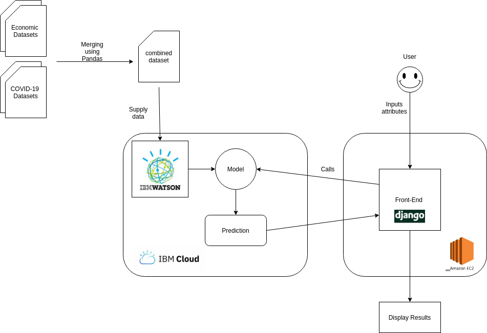

# COVID-19 on the Market
Predicting the stock market during a global pandemic.
# Abstract
COVID-19 is an ongoing pandemic currently affecting the entire world. Not only has this virus taken a toll on the population, but it also has massive effects on the economy. In order to contain the virus, people are being forced or are obligated to stop working, thus having a negative chain effect on other businesses. You can imagine the economy suffering in terms of the stock market and employment. Instead of letting this virus take its toll, it is best for us to prepare ourselves from what is impending. The best way to combat a virus and its adverse affects on us is to understand and predict what is coming. Understanding the trends that come with a dangerous pandemic is the best way to defend ourselves against it, whether if its protecting ourselves from the virus, or protecting ourselves financially. Being able to anticipate the harmful effects will help many people.This project utilizes the technologies of IBM Watson Machine Studio, Pandas, Python, and Django to achieve this.
# Architecture Diagram

# Technology Stack
#### Model
- IBM Watson Machine Studio
- Pandas
- Python
#### Website
- Django
- HTML/CSS
- AWS EC2
