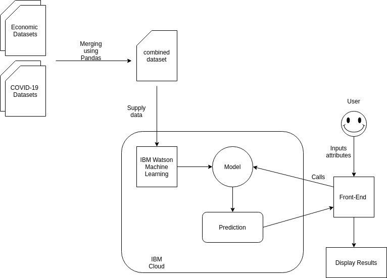

# COVID-19 on the Market
By Raymond Hong, Yathukulan Thayabaran, Zoe Lie, Michaela Molina
# Updates
### March 29th, 2020

- Found more datasets that would assist in finding economic impact of COVID-19 (Gas and unemployment)

### March 31th, 2020

- Got an example IBM Watson Model working. Able to use python to call the IBM server to send features, and receive a prediction off of a model created for estimating housing prices. Will use this for front-end developers to start working on a UI while Machine Learning Model is being developed. 

### April 1st,2020

- Digested the input data from multiple sources and converted it to a readable format by Watson. This was performed through Pandas. This digested data was then discussed with the team. After a team meeting, the apparent the deficencies in the data model were identified.

### April 3rd,2020

- More data gathered over the past two days was filtered and fed into the digester. The code was adjusted accordingly to perform the task. The new dataset is to be fed to the Machine Learning model. 

## Abstract
1. COVID-19 is an ongoing pandemic currently affecting the entire world. Not only has this virus taken a toll on the population, but it has massive effects on the economy. In order to contain the virus, people are being forced/obligated to stop working, thus having a chain effect on other businesses. You can imagine the economy suffering in terms of the stock market and employment. Instead of letting this virus take its tool, it is best for us to prepare ourselves from what is impending. 

3. The best way to combat a virus and its adverse affects on us, is to understand and predict what it coming. Understanding the trends that come with a dangerous pandemic is the best way to defend ourselves against it, whether its protecting ourselves from the virus, or to protect ourselves financially. Being able to anticipate the harmful affects will help many people 

4. This project will utilize technologies such as IBM Watson Machine Studio, Python Libraries Like Pandas for dataset merging. Other Front end frame works. 

Dataset: 

https://ww2.energy.ca.gov/almanac/transportation_data/gasoline/retail_gasoline_prices2_cms.html <-- CA Gas prices

https://oui.doleta.gov/unemploy/claims.asp   <-- Unemployment Claims

https://finance.yahoo.com/quote/%5EDJI?p=^DJI   <-- S&P500 Dataset

https://www.kaggle.com/c/covid19-global-forecasting-week-1/data <-- CoronaVirus Data
https://datahub.io/core/covid-19 

 The dataset is comprises of multiple datasets. The reason being is that there is no pregenerated dataset relating the corona virus statistics with the various economic statistics. Thus, in this project, we will have to make our own by stitching together these datasets. We are planning to get our data based on weeks starting in 2020, and do joins on the data to merge them together. 

# Architecture

