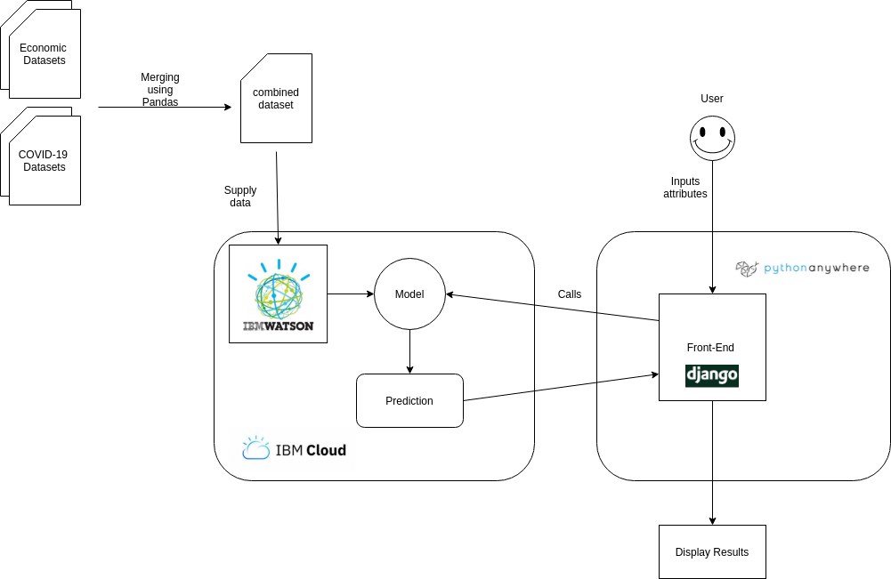
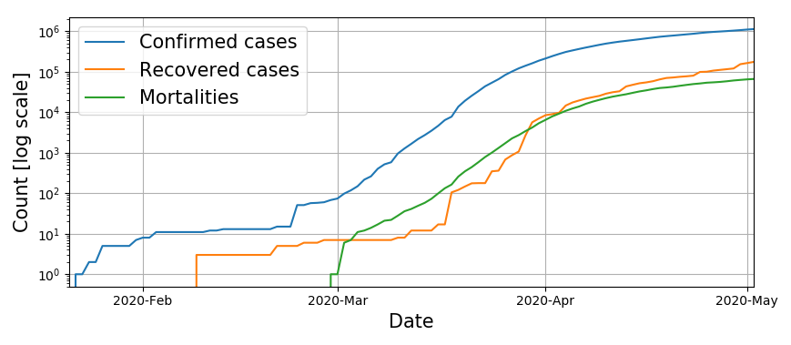
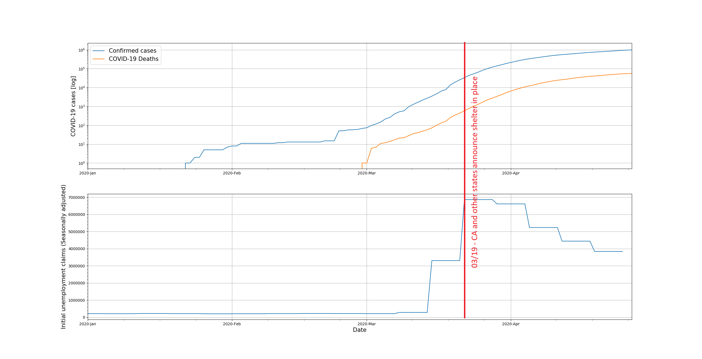
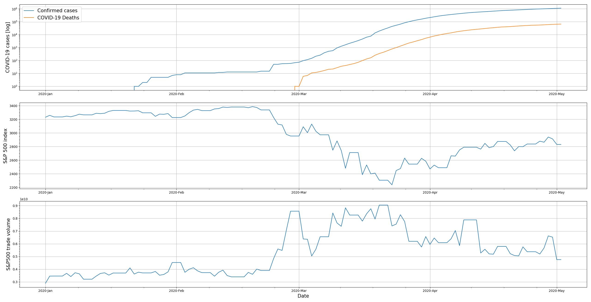
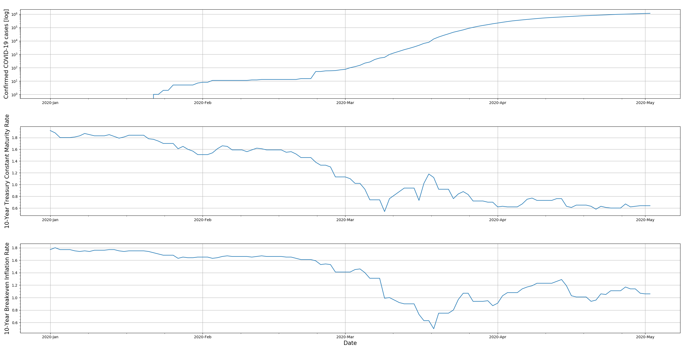
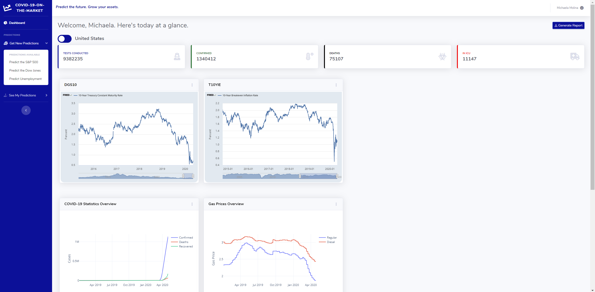
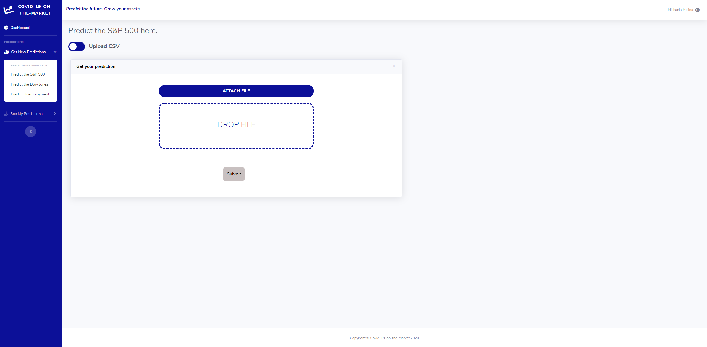
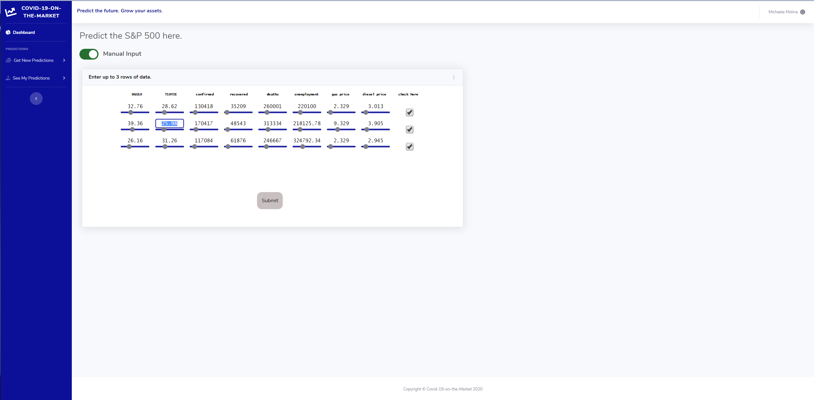

# COVID-19 on the Market
Predicting the stock market and unemployment rates during a global pandemic.
# Abstract
COVID-19 is an ongoing pandemic currently affecting the entire world. Not only has this virus taken a toll on the population, but it also has massive effects on the economy. In order to contain the virus, people are being forced or are obligated to stop working, thus having a negative chain effect on other businesses. You can imagine the economy suffering in terms of the stock market and employment. Instead of letting this virus take its toll, it is best for us to prepare ourselves from what is impending. The best way to combat a virus and its adverse affects on us is to understand and predict what is coming. Understanding the trends that come with a dangerous pandemic is the best way to defend ourselves against it, whether if its protecting ourselves from the virus, or protecting ourselves financially. Being able to anticipate the harmful effects will help many people. This project utilizes the technologies of IBM Watson Machine Studio, Pandas, Python, and Django to achieve this.
# Architecture Diagram

# Technology Stack
#### Model
- IBM Watson Studio
- Pandas
- Plot.ly
- COVID19Py

#### Website
- Django
- HTML/CSS
- Python Anywhere Cloud Service

# Visualizations

infection spread

Annotated combined economic indicators

ADS: Aruoba-Diebold-Scotti Business Conditions Index. Compound index from multiple low and high frequency data. Average is zero. Positive values mean good. Negative values mean bad.

WEI: Weekly Economic Index. A compound indicator of real economic activity. Sale of products and services, not bonds and stocks.

.png)

Annotated weekly unemployment filings  

S&P500 values and volume

Rates

Ten-Year Treasury Constant Maturity: Is used as reference pricing for securities (like corporate bonds)

Ten-Year Breakeven Inflation Rate: Expected inflation of the market over the next 10 years

# Website
We have used PythonAnywhere to host and deploy our application. The website can be found at this link http://rhong5.pythonanywhere.com/c19/.

This is what the website dashboard of the home page looks like with a summary of statistics including the number of tests conducted, the number of confirmed cases, the number of deaths, and the number of people in the ICU, as well as graphical visualizations.

This is an example of how the user can upload a csv file to generate new predictions.

This is an example of how the user can enter in values manually by typing in the text boxes or using the sliders to generate new predictions.

